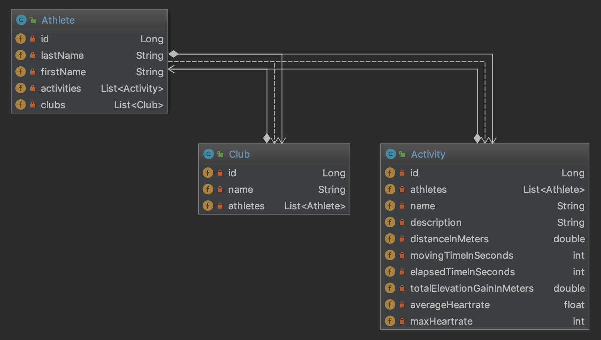

# GraphQL Workshop
GraphQL er et spørrespråk for å hente ut data fra en applikasjon server, og er et alternativ til REST og SOAP. Ved å benytte GraphQL som ett web service api får applikasjonen en kontrakt, et sterkt typet skjema og dokumentasjon rett ut av boksen. 
Denne Workshoppen setter fokus på hvordan graphql-spesifikasjonen passer inn i en Java-stack med Spring boot, hibernate og Maven.

GraphQL-Java implementerer spesifikasjonen GraphQL. 

## Graphql-java-tools

### Schema
```graphql
type Viewer {
    name: String,
    homes: [Home]!
}
type Home {
    id: ID!,
    appNickname: String
}
type Query {
    viewer:Viewer!
}
```

### Query
```graphql
{  
  viewer{  
   name  
   homes {
     appNickname
   }
  }  
}
```

### Resultat
```graphql
{
  "data": {
    "viewer": {
      "name": "Arya Stark",
      "homes": [
        {
          "appNickname": "Testvägen 72"
        }
      ]
    }
  }
}
```

## Demo

https://developer.tibber.com/explorer

## Kom i gang
Start med å clone dette git repo. Oppgaver gjøres rett på master branch.

### Dependencies
Følgende avhengigheter er sentrale for å få graphql-støtte i Spring Boot. GraphQL-Java leverer et sett med Spring Boot startere for å komme raskt i gang. 

```xml
<dependencies>
    <dependency>
        <groupId>com.graphql-java</groupId>
        <artifactId>graphql-spring-boot-starter</artifactId>
        <version>5.0.2</version>
    </dependency>
    <dependency>
        <groupId>com.graphql-java</groupId>
        <artifactId>graphql-java-tools</artifactId>
        <version>5.2.4</version>
    </dependency>
    <dependency>
        <groupId>com.graphql-java</groupId>
        <artifactId>graphiql-spring-boot-starter</artifactId>
        <version>5.0.2</version>
    </dependency>
</dependencies>
```
* Avhengigheten _graphql-spring-boot-starter_ drar inn alle de avhengighentene som er nødvendig for å serve graphql API'et fra webserveren.
* Avhengigheten _graphql-java-tools_ forenkler mye av utviklen da denne sørger for mappingen mellom graphql skjema og POJO-objektene. Den parser det gitte GraphQL schema og tillater BYOO (bring your own object) slik at du kan fylle inn implementasjonen. 
* Avhengigheten _graphiql-spring-boot-starter_ sørger for at GraphiQL kjøres opp. GraphiQL er et konsoll for å teste API'et. Defualt kjøres det opp under http://localhost:8080/graphiql. (Tas med i en applikasjon for testing og bør ikke bli med ut i produksjon)

### Intellij IDEA plugin
Kan være en fordel å installere _JS GraphQL_ plugin i intellij.

## Domene


## Oppgave 1 - GraphQL schema - types
GraphQL skjema må ligge i mappen resources/graphql med file extension ```.graphqls```. Det er allerede opprettet en fil i mappen graphql med navn ```athleteql.graphqls```. Utifra domenemodellen over, lag et passende graphql skjema for Athlete, Club og Activity.

[Hvordan lage graphql skjema](https://graphql.org/learn/)

## Oppgave 2 - GraphQL schema - query types
I samme skjemafilen opprett en query slik at det er mulig å hente ut alle athletes. Spørringen skal begrenses med en limit/count (påkrevd felt).

Grapqhl queryen skal speile følgende java-metode.

```Java
/**
* Returnerer alle atleter begrenset opppad til count
 */ 
public List<Athlete> getAthletes(final int count)
{
    return this.athleteService.getAllAthletes(count);
}
```

## Oppgave 3 - Persistence
Opprett entiteter ut fra domenemodellen i pakken no.bouvet.sandvika.domain. Tips: benytt Lombok for å generere getter/setter, hash code og equals.

Applikasjonen skal benytte Spring Boot data JPA for å persistere data til H2 DB. Opprett repository interface for Spring Boot data under pakken no.bouvet.sandvika.repository.

Eksemple for Athlete:
```java
package no.bouvet.sandvika.repository;

import Athlete;
import org.springframework.data.jpa.repository.JpaRepository;
import org.springframework.stereotype.Repository;

import java.util.List;

@Repository
public interface AthleteRepository extends JpaRepository<Athlete, Long>
{
    @Query("from Athlete")
    Stream<Athlete> streamAll();
}
```
For ytterligere informasjon om spring data sjekk ut [Spring Data JPA reference](https://docs.spring.io/spring-data/jpa/docs/current/reference/html/) dokumentasjon. 

## Oppgave 4 - Service
I en tradisjonsrik 3-delt applikasjon som denne trengs det selvsagt et service-lag. Opprett en service-klasse for Athlete:
```java
package no.bouvet.sandvika.service;

import java.util.List;
import java.util.Optional;
import java.util.stream.Collectors;

import org.springframework.stereotype.Service;
import org.springframework.transaction.annotation.Transactional;

import Athlete;
import AthleteRepository;

@Service
public class AthleteService
{
    private final AthleteRepository athleteRepository ;

    public AthleteService(final AthleteRepository athleteRepository) {
        this.athleteRepository = athleteRepository ;
    }

    @Transactional(readOnly = true)
    public List<Athlete> getAllAthletes(final int count) {
        return this.athleteRepository.streamAll()
            .limit(count)
            .collect(Collectors.toList());
    }
}
```

## Oppgave 5 - QraphQL Java Tools in action - root query
Det er på tide å sy sammen GraphQL skjema som vi opprettet tidligere med resten av applikasjonen. Dette gjøres med query resolvers. Som graphql-java-tools automatisk kobler opp mot graphql.

Opprett en ny klasse under pakken no.bouvet.sandvika.query med navn AthleteQuery.

```java
package no.bouvet.sandvika.query;

import java.util.List;
import java.util.Optional;

import javax.transaction.Transactional;

import com.coxautodev.graphql.tools.GraphQLQueryResolver;

import org.springframework.beans.factory.annotation.Autowired;
import org.springframework.stereotype.Component;

import Athlete;
import AthleteService;

@Component
public class AthleteQuery implements GraphQLQueryResolver
{
    private final AthleteService athleteService;

    @Autowired
    public AthleteQuery(AthleteService athleteService)
    {
        this.athleteService = athleteService;
    }

    public List<Athlete> getAthletes(final int count)
    {
        return this.athleteService.getAllAthletes(count);
    }
}
```
En Query er root eller entry point i GraphQL. Alle metoder definert som en query eller mutation (inserts kommer senere) i graphql skjema må resolve til en metode i en klasse som implementerer _GraphQLQueryResolver_ eller _GraphQLMutationResolver_.

## Oppgave 6 - First run
På tide å teste applikasjonen. Start opp og naviger til http://localhost:8080/graphiql.

Kjør følgende spørring:
```graphql
{
    athletes(count: 10) {
        id,
        firstName,
        lastName
    }
}
```
Merk dokumantasjonen til høyre og den smoothe intelliSensen :smirk:

### Oppgave 6.1

Test å kjøre Queryen
```Graphql
{
    athletes(count: 10) {
        id,
        firstName,
        lastName,
        activities {
            id,
            name
        }
    }
}
```

Du skal nå få en Exception, som forteller deg at graphql-java ikke vet hvordan den skal hente activities på athletes. Dette låses ved å lage en Resolver. Lag Resolveren.

```Java
package no.bouvet.sandvika.resolver;

import java.util.List;

import com.coxautodev.graphql.tools.GraphQLResolver;

import org.springframework.beans.factory.annotation.Autowired;
import org.springframework.stereotype.Component;

import Activity;
import Athlete;
import Club;
import ActivityRepository;
import ClubRepository;

@Component
public class AthleteResolver implements GraphQLResolver<Athlete>
{
    private final ActivityRepository activityRepository;

    @Autowired
    public AthleteResolver(ActivityRepository activityRepository)
    {
        this.activityRepository = activityRepository;
    }

    public List<Activity> activities(Athlete athlete)
    {
        return activityRepository.findByAthletes_Id(athlete.getId());
    }
}
```

Opprett et nytt Repository som henter alle aktivitetene som hører til en Athlete

```Java
package no.bouvet.sandvika.repository;

import Activity;
import org.springframework.data.jpa.repository.JpaRepository;

import java.util.List;

public interface ActivityRepository extends JpaRepository<Activity, Long>
{
    List<Activity> findByAthletes_Id(Long id);
}
```
Kjør spørringen som ga Exception, den skal nå returnere en Athlete med Activities

## Oppgave 7 - GraphQL schema - mutations
Mutations gir mulighet til å oppdatere, legge til og slette serverside data. 

Oppdater skjemafilen fra oppgave 1-2 med en ny mutation som skal opprette en ny Athlete i databasen.
* Parametre til metoden skal være firstname og lastname.
* metoden skal returnere det persisterte objektet Athlete.

## Oppgave 8 - Service for mutation
Utvid AthleteService slik at en kan lagre Athlete.
 
## Oppgave 9 - GraphQLMutationResolver

```Java
package no.bouvet.sandvika.mutation;

import com.coxautodev.graphql.tools.GraphQLMutationResolver;

import org.springframework.beans.factory.annotation.Autowired;
import org.springframework.stereotype.Component;

import Athlete;
import AthleteService;

@Component
public class AthleteMutation implements GraphQLMutationResolver
{
    private final AthleteService athleteService;

    @Autowired
    public AthleteMutation(AthleteService athleteService)
    {
        this.athleteService = athleteService;
    }

    public Athlete createAthlete(final String lastName, final String firstName) {
        return this.athleteService.createAthlete(lastName, firstName);
    }
}

```
Test å kalle mutationen og sjekk at athletes returnerer den nye atleten.

## Nyttige info

Endpoint:
http://localhost:8080/graphql

Test-client:
http://localhost:8080/graphiql

Browse database:
http://localhost:8080/h2-console/

## Queries

```graphql
{
    athletes(count: 10) {
        id,
        firstName,
        lastName
    }
}
```
```graphql
query {
    clubs {
        id,
        name,
        athletes{
            id,
            firstName,
            lastName,
            clubs{
                id,
                name
            }
            activities{
                id,
                name
            }
        }
    }
}
```

## Mutations
```graphql
mutation {
    createAthlete(lastName: "Tyson", firstName: "Mike"){
        id,
        firstName,
        lastName
    }
}
```
